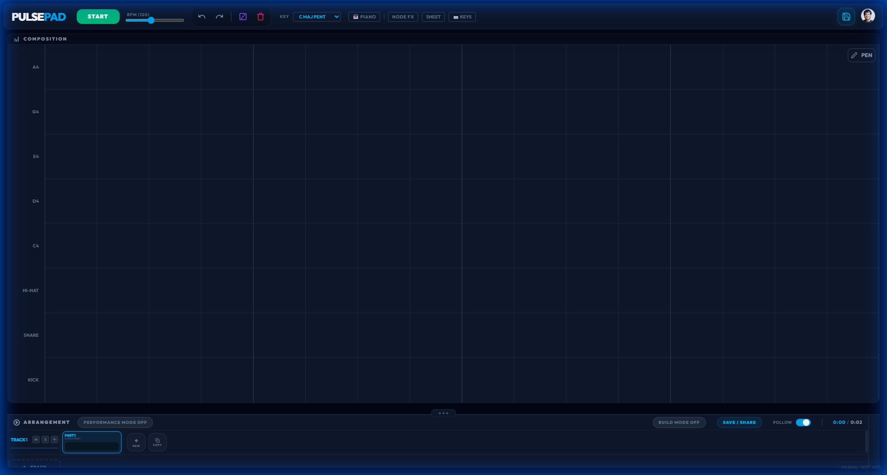
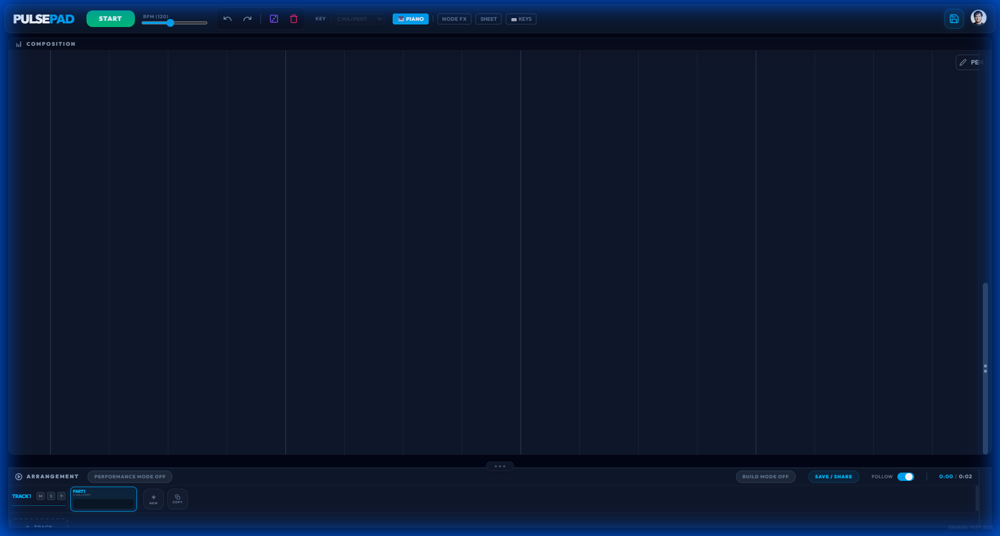
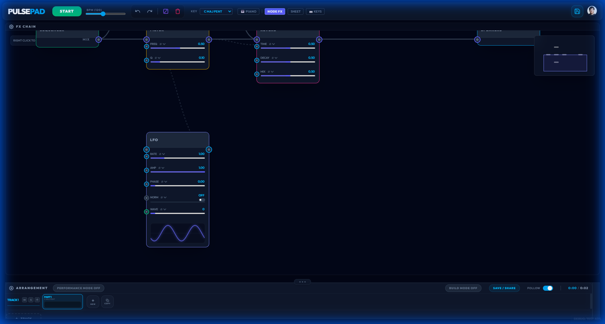

# 🎚️ PulsePad: Pattern-Based Music Evolution



> **"vibe coded with 💖" by Eric Bacus**

PulsePad is a laboratory for rhythmic and melodic exploration. Built entirely within the browser using React and WebAudio, this project serves as a deep-dive exploration into **agentic coding capabilities** using **Google Antigravity**. 

It transitions beyond a simple step sequencer into a high-speed, tactile environment for music creation, focusing on professional UI direction and robust, real-time execution.

---

## 🚀 The Vision
This project isn't just about making music; it's about pushing the boundaries of how AI agents can collaborate on complex, highly-interactive software. Every feature—from the **Topological FX Auto-Layout** to the **Premiere-style Vertical Zoom**—was developed through a recursive cycle of user feedback and agentic problem-solving.

### Core Explorations:
- **UI Interaction Density**: High-productivity hotkeys and gestural interactions (like magnetic node insertion).
- **Audio Topology**: Real-time modular routing with visual signal chain feedback.
- **Dynamic Inheritance**: Patterns that automatically inherit scales and rhythmic context from their neighbors.

---

## 🎨 Professional Interface

### 🎹 Advanced Piano Roll
The Piano Roll features a robust framing engine that ensures your focus starts on **C4** (or your existing notes). It integrates professional-grade navigation, including vertical "pinch" zooming and smooth scrolling.



### 🕸️ Modular FX Graph
A fully interactive nodal workspace. Route your audio through filters, delays, and distortions. Use modulation sources like LFOs to drive any parameter in the chain.



---

## ⚡ Productivity & Interaction (Hotkeys)

PulsePad is designed to be played like an instrument. Master these shortcuts to stay in the flow.

### 🏗️ Global System
- **`Space`**: Toggle Play/Stop.
- **`Ctrl + Z / Y`**: Full undo/redo stack for arrangement, notes, and wiring.
- **`Ctrl + D`**: Duplicate the currently editing pattern.
- **Double-Click BPM**: Reset to **120 BPM**.

### 🎹 Sequencer & Piano Roll
- **`V` / `C`**: Toggle between **Pointer** and **Razor** tools.
- **`Mouse Wheel`**: Vertical scroll (Shift focus).
- **`Alt + Drag`**: Clone a note instantly.
- **`Scroll while Dragging`**: Shift a note's octave on the fly.
- **`Vertical Gutter Drag`**: Strum through note labels to preview sounds.

### 🕸️ FX Graph (Nodal)
- **`L`**: Trigger **Topological Auto-Layout**. Organizes nodes into clear, non-overlapping columns based on connections.
- **`F`**: Frame all nodes in view.
- **`Y` (Hold)**: **Laser Cutter** tool. Slice through wires to disconnect them.
- **`Shift + Drag`**:
    - **Inject**: Drop a node onto a wire to insert it into the chain.
    - **Extract**: Pull a node out of a chain; neighbors bridge automatically.

---

## 🛠️ Technology Stack
- **Framework**: React 19 + TypeScript
- **Bundler**: Vite + HMR
- **Styling**: Tailwind CSS (Sophisticated Dark Mode / Glassmorphism)
- **Audio**: Custom WebAudio Engine (audioEngine.ts)
- **Deployment**: Firebase Hosting & Firestore

---

## 🧪 Development Workflow
PulsePad uses a modern React development flow:

```bash
# Clone the repository
git clone https://github.com/skittixch/PulseStudio

# Install dependencies
npm install

# Start development server
npm run dev
```

---

*Explore the latest live build at [pulsepad.web.app](https://pulsepad.web.app).*
